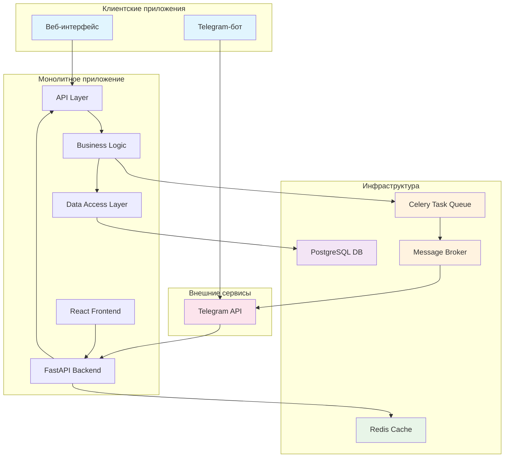

# Финальный архитектурный план системы "Пикфлоуметр"

## 1. Обзор системы

### 1.1. Цель
Создание системы для ежедневного контроля здоровья ребенка при астме и бронхите. Система позволяет ребенку вносить результаты замеров пикфлоуметра, а родителю - просматривать историю и графики для мониторинга состояния здоровья.

### 1.2. Основные компоненты
- Адаптивный веб-сайт (с акцентом на мобильную версию)
- Личные кабинеты для родителя и ребенка
- Telegram-бот для быстрого добавления замеров и напоминаний
- Единая база данных для всех данных

### 1.3. Архитектурный подход
Система использует монолитную архитектуру с модульной структурой внутри, что обеспечивает:
- Простоту разработки и поддержки
- Ограниченную сложность системы
- Упрощенное развертывание и обслуживание
- Единую кодовую базу, снижающую вероятность несоответствий

## 2. Технологический стек

### 2.1. Бэкенд
- **Язык программирования**: Python
- **Фреймворк**: FastAPI
- **Преимущества**:
  - Высокая производительность
  - Встроенная поддержка асинхронности
 - Автоматическая документация API (Swagger/OpenAPI)
  - Хорошая поддержка валидации данных через Pydantic

### 2.2. Фронтенд
- **Фреймворк**: React.js с TypeScript
- **Библиотеки компонентов**: Material-UI или Chakra UI
- **Графики**: Chart.js или D3.js
- **Преимущества**:
  - Адаптивный дизайн
  - Богатая экосистема
  - Хорошая поддержка мобильных устройств

### 2.3. База данных
- **Основная БД**: PostgreSQL
- **Преимущества**:
  - Надежность и стабильность
  - Поддержка сложных запросов
 - Хорошая производительность
 - Поддержка JSON-полей для гибкости

### 2.4. Дополнительные технологии
- **ORM**: SQLAlchemy
- **Аутентификация**: JWT-токены
- **Кеширование**: Redis
- **HTTP-сервер**: Uvicorn
- **Контейнеризация**: Docker
- **Очередь задач**: Celery

## 3. Структура проекта

```
peakflow-meter/
├── backend/
│   ├── app/
│   ├── api/
│   ├── models/
│   ├── schemas/
│   ├── database/
│   ├── auth/
│   ├── tasks/
│   └── main.py
├── frontend/
│   ├── src/
│   ├── public/
│   └── package.json
├── docker/
│   ├── docker-compose.yml
│   ├── nginx.conf
│   └── Dockerfile
├── database/
│   └── migrations/
├── plans/
│   └── архитектурные_документы.md
└── docs/
    └── deployment.md
```

## 4. API-архитектура

### 4.1. Структура API
API построено по REST-принципам с использованием JSON для передачи данных. Единое для веб-интерфейса и Telegram-бота.

### 4.2. Основные endpoints

#### Аутентификация:
- `POST /api/auth/login` - вход пользователя
- `POST /api/auth/register` - регистрация родителя
- `POST /api/auth/child-register` - регистрация ребенка (по приглашению родителя)
- `POST /api/auth/refresh` - обновление токена

#### Управление пользователями:
- `GET /api/user/profile` - получение профиля пользователя
- `PUT /api/user/profile` - обновление профиля пользователя
- `GET /api/user/child-profile` - получение профиля ребенка
- `PUT /api/user/child-profile` - обновление профиля ребенка (только родителем)

#### Замеры:
- `POST /api/measurements` - добавление нового замера
- `GET /api/measurements` - получение истории замеров (с фильтрами)
- `GET /api/measurements/latest` - получение последнего замера
- `DELETE /api/measurements/{id}` - удаление замера (только родителем)

#### Расчет зон:
- `GET /api/zones/current` - получение текущих границ зон для ребенка
- `GET /api/zones/status` - получение текущего статуса (цвет зоны) по последнему замеру

#### Графики и статистика:
- `GET /api/statistics/overview` - общая статистика для родительского интерфейса
- `GET /api/statistics/chart-data` - данные для построения графиков

#### Уведомления и напоминания:
- `GET /api/reminders` - получение настроек напоминаний
- `PUT /api/reminders` - обновление настроек напоминаний
- `POST /api/reminders/test` - тестирование отправки напоминания

#### Для Telegram-бота:
- `POST /api/telegram/webhook` - вебхук для получения сообщений от Telegram
- `POST /api/telegram/send-message` - отправка сообщений в Telegram (для уведомлений)

## 5. Система напоминаний и уведомлений

### 5.1. Компоненты:
- Использование Celery с Redis для асинхронной обработки задач
- APScheduler для планирования периодических задач
- Модуль для работы с Telegram API
- Вебхуки для получения статуса доставки уведомлений

### 5.2. Типы уведомлений:
- Напоминания о замерах (ежедневно по расписанию)
- Предупреждения о низких значениях (попадание в желтую/красную зону)
- Позитивные уведомления (например, достижение серии хороших замеров)

## 6. Схема базы данных

### 6.1. Основные таблицы:

#### users
```sql
id (SERIAL, PRIMARY KEY)
username (VARCHAR UNIQUE)
email (VARCHAR UNIQUE)
password_hash (VARCHAR)
role (ENUM: 'parent', 'child')
is_active (BOOLEAN)
created_at (TIMESTAMP)
updated_at (TIMESTAMP)
```

#### child_profiles
```sql
id (SERIAL, PRIMARY KEY)
user_id (INTEGER REFERENCES users(id))
parent_id (INTEGER REFERENCES users(id))
first_name (VARCHAR)
last_name (VARCHAR)
birth_date (DATE)
height (INTEGER) -- в сантиметрах
gender (ENUM: 'male', 'female')
created_at (TIMESTAMP)
updated_at (TIMESTAMP)
best_result (INTEGER) -- лучший показатель для расчета зон
```

#### measurements
```sql
id (SERIAL, PRIMARY KEY)
child_id (INTEGER REFERENCES child_profiles(id))
value (INTEGER) -- результат замера в л/мин
timestamp (TIMESTAMP WITH TIME ZONE)
zone (ENUM: 'green', 'yellow', 'red')
notes (TEXT) -- дополнительные заметки
created_at (TIMESTAMP)
```

#### reminders
```sql
id (SERIAL, PRIMARY KEY)
child_id (INTEGER REFERENCES child_profiles(id))
time_of_day (TIME) -- время в формате HH:MM
days_of_week (INTEGER[]) -- массив дней недели (1-7)
is_active (BOOLEAN)
notification_type (ENUM: 'telegram', 'email', 'both')
created_at (TIMESTAMP)
updated_at (TIMESTAMP)
```

#### notifications
```sql
id (SERIAL, PRIMARY KEY)
user_id (INTEGER REFERENCES users(id))
reminder_id (INTEGER REFERENCES reminders(id))
message_text (TEXT)
sent_at (TIMESTAMP WITH TIME ZONE)
status (ENUM: 'pending', 'sent', 'failed')
notification_channel (ENUM: 'telegram', 'email')
```

#### sessions
```sql
id (SERIAL, PRIMARY KEY)
user_id (INTEGER REFERENCES users(id))
token (VARCHAR UNIQUE)
expires_at (TIMESTAMP WITH TIME ZONE)
created_at (TIMESTAMP)
user_agent (TEXT)
ip_address (INET)
```

#### profile_settings
```sql
id (SERIAL, PRIMARY KEY)
child_id (INTEGER REFERENCES child_profiles(id))
zone_green_min (INTEGER) -- минимальное значение зеленой зоны
zone_yellow_min (INTEGER) -- минимальное значение желтой зоны  
zone_red_min (INTEGER) -- минимальное значение красной зоны
calculation_method (VARCHAR) -- метод расчета зон (по возрасту/росту)
updated_at (TIMESTAMP)
```

#### parent_child_relations
```sql
id (SERIAL, PRIMARY KEY)
parent_id (INTEGER REFERENCES users(id))
child_id (INTEGER REFERENCES child_profiles(id))
relationship_status (ENUM: 'active', 'pending', 'removed')
created_at (TIMESTAMP)
```

### 6.2. Индексы:
- Индекс на `measurements.child_id` и `measurements.timestamp`
- Индекс на `users.email`
- Индекс на `reminders.child_id` и `reminders.time_of_day`
- Индекс на `sessions.token`

## 7. Расчет зон пикфлоу

### 7.1. Медицинские формулы
Система использует персонализированный подход к определению зон на основе индивидуальных характеристик ребенка: возраста, пола и роста.

#### Для мальчиков:
- **До 13 лет**: ПСВ = 105.4 + (5.52 × рост в см) - (0.028 × возраст²)
- **13-18 лет**: ПСВ = 79.6 + (4.25 × рост в см) + (2.18 × возраст)

#### Для девочек:
- **До 13 лет**: ПСВ = 98.3 + (4.76 × рост в см) - (0.026 × возраст²)
- **13-18 лет**: ПСВ = 69.0 + (3.35 × рост в см) + (1.95 × возраст)

### 7.2. Определение зон:
- **Зеленая зона (норма)**: 80-100% от нормативного значения ПСВ
- **Желтая зона (осторожно)**: 60-79% от нормативного значения ПСВ
- **Красная зона (опасность)**: Ниже 60% от нормативного значения ПСВ

## 8. Адаптивность и мобильная оптимизация

### 8.1. Принципы:
- Mobile-first подход
- Адаптивная сетка (CSS Grid и Flexbox)
- Responsive breakpoints: 320px, 768px, 1024px, 1200px

### 8.2. Особенности интерфейса:

#### Для ребенка:
- Простой интерфейс с крупными кнопками
- Цветовая индикация статуса (зеленый/желтый/красный)
- Минимальное количество текста
- Визуальные подсказки
- Одно основное действие - ввод результата замера

#### Для родителя:
- Более подробный интерфейс с графиками и статистикой
- Возможность настройки профиля ребенка
- История замеров с фильтрами
- Настройка напоминаний

### 8.3. Технические оптимизации:
- Lazy loading компонентов
- Code splitting
- Оптимизация изображений
- Service Workers для оффлайн-функциональности
- Progressive Web App (PWA) возможности

## 9. Безопасность

### 9.1. Аутентификация и авторизация:
- JWT-токены с ограниченным сроком действия
- Ролевая система с разграничением прав
- Подтверждение email при регистрации
- Система приглашений для добавления детей

### 9.2. Защита данных:
- Хранение паролей с использованием bcrypt
- Шифрование чувствительных данных
- HTTPS для всех соединений
- Rate limiting и CSRF-защита

### 9.3. Безопасность Telegram-бота:
- Проверка подписи вебхуков от Telegram
- Аутентификация пользователей бота через систему учетных записей

### 9.4. Мониторинг:
- Логирование всех аутентификационных событий
- Логирование доступа к медицинским данным
- Регулярные проверки безопасности

## 10. Отказоустойчивость и восстановление

### 10.1. Резервирование компонентов:
- Использование облачных сервисов с SLA не менее 99.9%
- Горячее резервирование базы данных (master-slave репликация)
- Использование балансировщиков нагрузки
- Дублирование критических компонентов

### 10.2. Резервное копирование:
- Полное резервное копирование базы данных: ежедневно в 02:00 по МСК
- Инкрементальное резервное копирование: каждые 4 часа
- Хранение копий за последние 30 дней (ежедневные) и 12 месяцев (ежемесячные)
- Шифрование резервных копий AES-256

### 10.3. План восстановления:
- RTO (Recovery Time Objective): 2 часа
- RPO (Recovery Point Objective): 4 часа (максимальная потеря данных)

## 11. Производительность и масштабируемость

### 11.1. Оптимизация базы данных:
- Создание составных индексов для частых запросов
- Использование пула соединений SQLAlchemy
- Кеширование результатов с помощью Redis

### 11.2. Кеширование:
- Кеширование результатов расчета зон (на 24 часа)
- Кеширование профилей пользователей и детей (на 1 час)
- Кеширование настроек напоминаний (на 2 часа)

### 11.3. Масштабируемость:
- Возможность горизонтального масштабирования до 10 инстансов
- Использование балансировщика нагрузки
- Поддержка читательских реплик PostgreSQL

### 11.4. Целевые метрики:
- 95-й перцентиль времени отклика API: < 500мс
- Поддержка 1000 одновременных пользователей
- Время загрузки главной страницы: < 3с

## 12. Тестирование

### 12.1. Уровни тестирования:
- Модульное тестирование (покрытие не менее 80%)
- Интеграционное тестирование
- Функциональное тестирование
- Нагрузочное тестирование

### 12.2. Инструменты:
- pytest для Python-компонентов
- Jest и React Testing Library для фронтенда
- Playwright для E2E тестирования
- Locust для нагрузочного тестирования

## 13. CI/CD процессы

### 13.1. Инструменты:
- GitHub Actions для CI/CD
- Docker для контейнеризации
- SonarQube для статического анализа
- Snyk для сканирования уязвимостей

### 13.2. Этапы pipeline:
1. Проверка линтером
2. Модульные и интеграционные тесты
3. Сборка Docker-образов
4. Развертывание в тестовое окружение
5. E2E тестирование
6. Развертывание в продакшен (с подтверждением)

## 14. Диаграммы

### 14.1. Архитектурная диаграмма


### 14.2. Диаграмма развертывания
(Описание развертывания компонентов по серверам и контейнерам)

### 14.3. Диаграммы последовательности
(Основные пользовательские сценарии: регистрация, добавление замеров, просмотр статистики)

## 15. Рекомендации по развертыванию

### 15.1. Серверные требования:
- Минимум 2GB RAM (рекомендуется 4GB)
- 2 CPU ядра
- SSD хранилище (минимум 20GB)
- Поддержка Docker и Docker Compose

### 15.2. Безопасность развертывания:
- Использование SSL-сертификатов (Let's Encrypt)
- Настройка брандмауэра
- Использование env-файлов для хранения конфигураций

### 15.3. Мониторинг и логирование:
- Централизованное логирование через Docker
- Мониторинг состояния сервисов
- Алерты при падении сервисов

## 16. Заключение

Система "Пикфлоуметр" спроектирована как надежное, безопасное и масштабируемое решение для ежедневного контроля здоровья ребенка. Архитектура обеспечивает:
- Высокий уровень безопасности медицинских данных
- Надежную систему напоминаний и уведомлений
- Интуитивно понятный интерфейс для детей и родителей
- Персонализированный расчет зон на основе медицинских стандартов
- Возможность масштабирования при росте числа пользователей
- Полностью автоматизированные процессы разработки и развертывания

Все архитектурные решения согласованы между собой и соответствуют целям проекта - созданию эффективной системы для мониторинга здоровья детей с астмой и бронхитом.