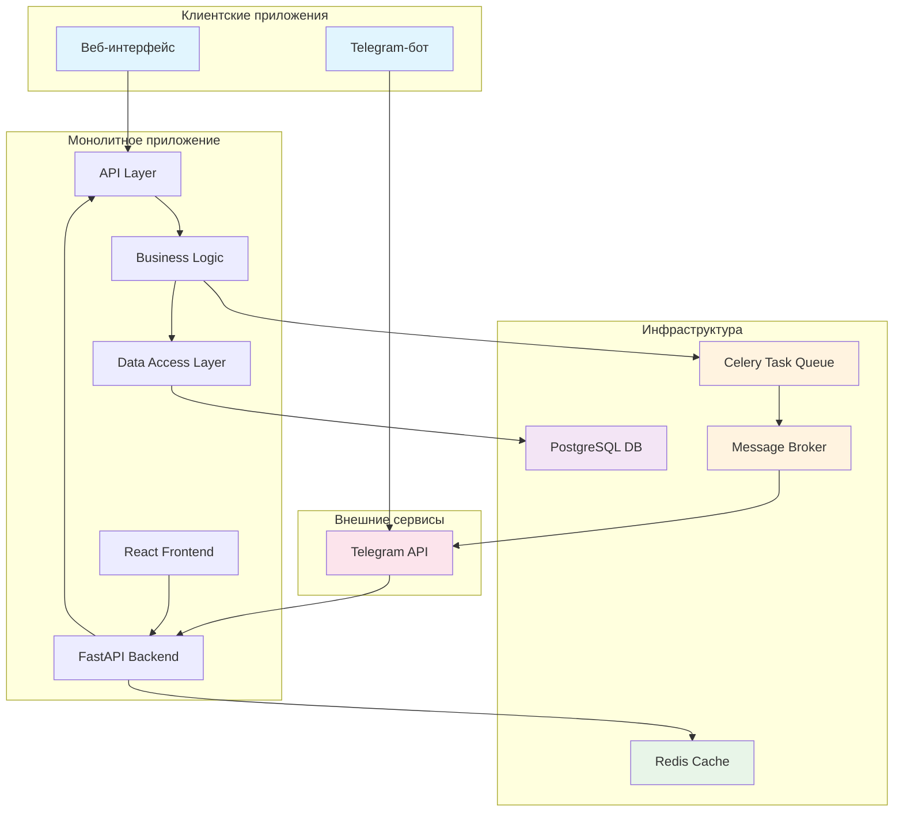

# Техническая архитектура медицинского трекера «Пикфлоуметр»

## 1. Обзор системы

### Цель
Система для ежедневного контроля здоровья ребенка (астма, бронхит). Ребенок вносит результаты замеров, родитель видит историю и графики.

### Основные компоненты
- Адаптивный веб-сайт (мобильная версия — обязательна и главный приоритет)
- Личные кабинеты для родителя и ребенка
- Telegram-бот для быстрого добавления замеров и напоминаний
- Единая база данных для всех данных

## 2. Архитектурный подход

Для системы выбран **монолитный подход** по следующим причинам:
- Простота разработки и поддержки
- Ограниченная сложность системы
- Нет необходимости в высокой нагрузке
- Упрощенное развертывание и обслуживание
- Единая кодовая база снижает вероятность несоответствий

При этом архитектура внутри монолита будет модульной с четким разделением на слои:
- Слой представления (веб-интерфейс)
- Слой API (для веб-интерфейса и бота)
- Слой бизнес-логики
- Слой данных

## 3. Технологический стек

### Бэкенд
- **Язык программирования**: Python
- **Фреймворк**: FastAPI
- **Преимущества**:
  - Высокая производительность
  - Встроенная поддержка асинхронности
  - Автоматическая документация API (Swagger/OpenAPI)
  - Хорошая поддержка валидации данных через Pydantic

### Фронтенд
- **Фреймворк**: React.js с TypeScript
- **Библиотеки компонентов**: Material-UI или Chakra UI
- **Графики**: Chart.js или D3.js
- **Преимущества**:
  - Адаптивный дизайн
  - Богатая экосистема
  - Хорошая поддержка мобильных устройств

### База данных
- **Основная БД**: PostgreSQL
- **Преимущества**:
  - Надежность и стабильность
  - Поддержка сложных запросов
  - Хорошая производительность
  - Поддержка JSON-полей для гибкости

### Дополнительные технологии
- **ORM**: SQLAlchemy
- **Аутентификация**: JWT-токены
- **Кеширование**: Redis
- **HTTP-сервер**: Uvicorn
- **Контейнеризация**: Docker

## 4. API-архитектура

### Структура API
API построено по REST-принципам с использованием JSON для передачи данных. Единое для веб-интерфейса и Telegram-бота.

### Основные endpoints

#### Аутентификация:
- `POST /api/auth/login` - вход пользователя
- `POST /api/auth/register` - регистрация родителя
- `POST /api/auth/child-register` - регистрация ребенка (по приглашению родителя)
- `POST /api/auth/refresh` - обновление токена

#### Управление пользователями:
- `GET /api/user/profile` - получение профиля пользователя
- `PUT /api/user/profile` - обновление профиля пользователя
- `GET /api/user/child-profile` - получение профиля ребенка
- `PUT /api/user/child-profile` - обновление профиля ребенка (только родителем)

#### Замеры:
- `POST /api/measurements` - добавление нового замера
- `GET /api/measurements` - получение истории замеров (с фильтрами)
- `GET /api/measurements/latest` - получение последнего замера
- `DELETE /api/measurements/{id}` - удаление замера (только родителем)

#### Расчет зон:
- `GET /api/zones/current` - получение текущих границ зон для ребенка
- `GET /api/zones/status` - получение текущего статуса (цвет зоны) по последнему замеру

#### Графики и статистика:
- `GET /api/statistics/overview` - общая статистика для родительского интерфейса
- `GET /api/statistics/chart-data` - данные для построения графиков

#### Уведомления и напоминания:
- `GET /api/reminders` - получение настроек напоминаний
- `PUT /api/reminders` - обновление настроек напоминаний
- `POST /api/reminders/test` - тестирование отправки напоминания

#### Для Telegram-бота:
- `POST /api/telegram/webhook` - вебхук для получения сообщений от Telegram
- `POST /api/telegram/send-message` - отправка сообщений в Telegram (для уведомлений)

## 5. Система напоминаний и уведомлений

### Компоненты:
- Использование Celery с Redis для асинхронной обработки задач
- APScheduler для планирования периодических задач
- Модуль для работы с Telegram API
- Вебхуки для получения статуса доставки уведомлений

### Типы уведомлений:
- Напоминания о замерах (ежедневно по расписанию)
- Предупреждения о низких значениях (попадание в желтую/красную зону)
- Позитивные уведомления (например, достижение серии хороших замеров)

### Настройка через API:
- `GET /api/reminders` - получение текущих настроек
- `PUT /api/reminders` - обновление настроек напоминаний
- `POST /api/reminders/test` - тестовая отправка

## 6. Схема базы данных

### Основные таблицы:

#### users
```sql
id (SERIAL, PRIMARY KEY)
username (VARCHAR UNIQUE)
email (VARCHAR UNIQUE)
password_hash (VARCHAR)
role (ENUM: 'parent', 'child')
is_active (BOOLEAN)
created_at (TIMESTAMP)
updated_at (TIMESTAMP)
```

#### child_profiles
```sql
id (SERIAL, PRIMARY KEY)
user_id (INTEGER REFERENCES users(id))
parent_id (INTEGER REFERENCES users(id))
first_name (VARCHAR)
last_name (VARCHAR)
birth_date (DATE)
height (INTEGER) -- в сантиметрах
gender (ENUM: 'male', 'female')
created_at (TIMESTAMP)
updated_at (TIMESTAMP)
best_result (INTEGER) -- лучший показатель для расчета зон
```

#### measurements
```sql
id (SERIAL, PRIMARY KEY)
child_id (INTEGER REFERENCES child_profiles(id))
value (INTEGER) -- результат замера в л/мин
timestamp (TIMESTAMP WITH TIME ZONE)
zone (ENUM: 'green', 'yellow', 'red')
notes (TEXT) -- дополнительные заметки
created_at (TIMESTAMP)
```

#### reminders
```sql
id (SERIAL, PRIMARY KEY)
child_id (INTEGER REFERENCES child_profiles(id))
time_of_day (TIME) -- время в формате HH:MM
days_of_week (INTEGER[]) -- массив дней недели (1-7)
is_active (BOOLEAN)
notification_type (ENUM: 'telegram', 'email', 'both')
created_at (TIMESTAMP)
updated_at (TIMESTAMP)
```

#### notifications
```sql
id (SERIAL, PRIMARY KEY)
user_id (INTEGER REFERENCES users(id))
reminder_id (INTEGER REFERENCES reminders(id))
message_text (TEXT)
sent_at (TIMESTAMP WITH TIME ZONE)
status (ENUM: 'pending', 'sent', 'failed')
notification_channel (ENUM: 'telegram', 'email')
```

#### sessions
```sql
id (SERIAL, PRIMARY KEY)
user_id (INTEGER REFERENCES users(id))
token (VARCHAR UNIQUE)
expires_at (TIMESTAMP WITH TIME ZONE)
created_at (TIMESTAMP)
user_agent (TEXT)
ip_address (INET)
```

#### profile_settings
```sql
id (SERIAL, PRIMARY KEY)
child_id (INTEGER REFERENCES child_profiles(id))
zone_green_min (INTEGER) -- минимальное значение зеленой зоны
zone_yellow_min (INTEGER) -- минимальное значение желтой зоны  
zone_red_min (INTEGER) -- минимальное значение красной зоны
calculation_method (VARCHAR) -- метод расчета зон (по возрасту/росту)
updated_at (TIMESTAMP)
```

#### parent_child_relations
```sql
id (SERIAL, PRIMARY KEY)
parent_id (INTEGER REFERENCES users(id))
child_id (INTEGER REFERENCES child_profiles(id))
relationship_status (ENUM: 'active', 'pending', 'removed')
created_at (TIMESTAMP)
```

### Индексы:
- Индекс на `measurements.child_id` и `measurements.timestamp`
- Индекс на `users.email`
- Индекс на `reminders.child_id` и `reminders.time_of_day`
- Индекс на `sessions.token`

## 7. Адаптивность и мобильная оптимизация

### Принципы:
- Mobile-first подход
- Адаптивная сетка (CSS Grid и Flexbox)
- Responsive breakpoints: 320px, 768px, 1024px, 1200px

### Особенности интерфейса:
#### Для ребенка:
- Простой интерфейс с крупными кнопками
- Цветовая индикация статуса (зеленый/желтый/красный)
- Минимальное количество текста
- Визуальные подсказки
- Одно основное действие - ввод результата замера

#### Для родителя:
- Более подробный интерфейс с графиками и статистикой
- Возможность настройки профиля ребенка
- История замеров с фильтрами
- Настройка напоминаний

### Технические оптимизации:
- Lazy loading компонентов
- Code splitting
- Оптимизация изображений
- Service Workers для оффлайн-функциональности
- Progressive Web App (PWA) возможности

## 8. Безопасность

### Аутентификация и авторизация:
- JWT-токены с ограниченным сроком действия
- Ролевая система с разграничением прав
- Подтверждение email при регистрации
- Система приглашений для добавления детей

### Защита данных:
- Хранение паролей с использованием bcrypt
- Шифрование чувствительных данных
- HTTPS для всех соединений
- Rate limiting и CSRF-защита

### Безопасность Telegram-бота:
- Проверка подписи вебхуков от Telegram
- Аутентификация пользователей бота через систему учетных записей

### Мониторинг:
- Логирование всех аутентификационных событий
- Логирование доступа к медицинским данным
- Регулярные проверки безопасности

## 9. Архитектурная диаграмма



## 10. Рекомендации по развертыванию

### Структура проекта:
```
peakflow-meter/
├── backend/
│   ├── app/
│   ├── api/
│   ├── models/
│   ├── schemas/
│   ├── database/
│   ├── auth/
│   ├── tasks/
│   └── main.py
├── frontend/
│   ├── src/
│   ├── public/
│   └── package.json
├── docker/
│   ├── docker-compose.yml
│   ├── nginx.conf
│   └── Dockerfile
├── database/
│   └── migrations/
└── docs/
    └── deployment.md
```

### Серверные требования:
- Минимум 2GB RAM (рекомендуется 4GB)
- 2 CPU ядра
- SSD хранилище (минимум 20GB)
- Поддержка Docker и Docker Compose

### Конфигурация Docker Compose:
```yaml
version: '3.8'
services:
  db:
    image: postgres:15
    environment:
      POSTGRES_DB: peakflow_db
      POSTGRES_USER: user
      POSTGRES_PASSWORD: password
    volumes:
      - postgres_data:/var/lib/postgresql/data
    ports:
      - "5432:5432"

  redis:
    image: redis:7-alpine
    ports:
      - "6379:6379"

  backend:
    build: ./backend
    ports:
      - "8000:8000"
    depends_on:
      - db
      - redis
    environment:
      - DATABASE_URL=postgresql://user:password@db:5432/peakflow_db
      - REDIS_URL=redis://redis:6379

  frontend:
    build: ./frontend
    ports:
      - "80:80"
    depends_on:
      - backend

  celery:
    build: ./backend
    command: celery -A app.tasks worker --loglevel=info
    depends_on:
      - redis
      - db

volumes:
 postgres_data:
```

### Безопасность развертывания:
- Использование SSL-сертификатов (Let's Encrypt)
- Настройка брандмауэра
- Использование env-файлов для хранения конфигураций

### Мониторинг и логирование:
- Централизованное логирование через Docker
- Мониторинг состояния сервисов
- Алерты при падении сервисов

### Резервное копирование:
- Регулярный экспорт базы данных
- Хранение бэкапов в зашифрованном виде
- Автоматизация процесса резервного копирования

### CI/CD:
- Использование GitHub Actions или GitLab CI
- Автоматическое тестирование перед деплоем
- Этапы: тестирование → сборка → тестовый деплой → продакшн