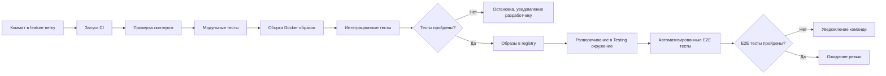
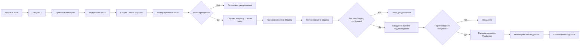

# Рекомендации по CI/CD процессам для системы "Пикфлоуметр"

## 1. Общая концепция CI/CD

Непрерывная интеграция и доставка (CI/CD) для системы "Пикфлоуметр" должна обеспечивать автоматизированный, надежный и безопасный процесс разработки, тестирования и развертывания приложения. Процессы должны поддерживать высокое качество кода и быструю доставку изменений в продакшен.

## 2. Архитектура CI/CD

### 2.1. Инструменты

- **CI/CD платформа**: GitHub Actions (или GitLab CI/CD)
- **Контейнеризация**: Docker
- **Оркестрация**: Docker Compose или Kubernetes
- **Тестирование**: pytest, Jest, Playwright
- **Сканирование уязвимостей**: OWASP ZAP, SonarQube, Snyk
- **Мониторинг**: Prometheus, Grafana

### 2.2. Окружения

- **Development**: Для разработчиков
- **Testing**: Для автоматизированного тестирования
- **Staging/Pre-production**: Для UAT и ручного тестирования
- **Production**: Продакшен-окружение

## 3. Pipeline CI/CD

### 3.1. Pipeline для ветки разработки (feature/hotfix)



### 3.2. Pipeline для основной ветки (main/master)



## 4. Этапы CI/CD Pipeline

### 4.1. Этап: Проверка кода

**Цель**: Обеспечение качества и безопасности кода

**Действия**:
- Запуск линтеров (flake8, mypy, eslint)
- Статический анализ кода (SonarQube)
- Сканирование уязвимостей (Snyk, OWASP Dependency Check)
- Проверка лицензий зависимостей

**Условия**: Все проверки должны пройти успешно

### 4.2. Этап: Тестирование

**Цель**: Проверка корректности работы приложения

**Действия**:
- Модульные тесты (покрытие не менее 80%)
- Интеграционные тесты
- Тестирование безопасности
- Тестирование производительности

**Условия**: Все тесты должны пройти успешно

### 4.3. Этап: Сборка

**Цель**: Создание готовых к развертыванию артефактов

**Действия**:
- Сборка Docker-образов
- Присвоение тегов (commit hash, latest)
- Проверка образов на уязвимости

**Условия**: Образы должны быть успешно собраны и протестированы

### 4.4. Этап: Развертывание

**Цель**: Безопасное развертывание приложения в окружениях

**Действия**:
- Развертывание в тестовое окружение
- Запуск E2E тестов
- Развертывание в продакшен (с подтверждением)

**Условия**: Успешное развертывание и прохождение тестов

## 5. Git Workflow

### 5.1. Ветвление

```
main (production-ready)
├── develop (integration branch)
├── feature/feature-name
├── hotfix/hotfix-name
└── release/release-version
```

### 5.2. Требования к коммитам

- Использование conventional commits
- Обязательное описание изменений
- Ссылки на задачи в трекере

Пример:
```
feat(auth): add JWT refresh token mechanism

- Implement refresh token rotation
- Add token blacklisting
- Update auth middleware

Closes #123
```

## 6. Безопасность CI/CD

### 6.1. Управление секретами

- Использование систем управления секретами (GitHub Secrets, HashiCorp Vault)
- Запрет на хранение секретов в коде
- Ротация токенов не реже 1 раза в 90 дней

### 6.2. Защита от утечек данных

- Сканирование коммитов наличие секретов (TruffleHog)
- Ограничение прав доступа к CI/CD системе
- Аудит всех операций в CI/CD системе

## 7. Мониторинг и оповещения

### 7.1. Метрики CI/CD

- Время выполнения pipeline
- Частота сбоев
- Время доставки изменений
- Покрытие тестами

### 7.2. Оповещения

- О сбоях в pipeline
- О снижении покрытия тестами
- О найденных уязвимостях
- О успешных деплоях

## 8. Рекомендации по практикам

### 8.1. Infrastructure as Code

- Хранение конфигурации инфраструктуры в репозитории
- Использование Terraform или Ansible
- Версионирование конфигураций

### 8.2. GitOps

- Использование Git как источника истины для состояния инфраструктуры
- Автоматическая синхронизация с продакшеном
- Одобрение изменений через pull requests

### 8.3. Blue-Green Deployment

- Для критических обновлений использовать blue-green деплой
- Обеспечение возможности быстрого отката
- Тестирование в продакшене перед переключением трафика

## 9. Документация и обучение

### 9.1. Документация процессов

- Документация CI/CD процессов
- Руководство по устранению неполадок
- Шаблоны для различных типов изменений

### 9.2. Обучение команды

- Регулярные тренинги по CI/CD процессам
- Документация best practices
- Code review процесс включая CI/CD аспекты

## 10. Пример GitHub Actions Workflow

```yaml
name: CI/CD Pipeline

on:
  push:
    branches: [ main, develop ]
  pull_request:
    branches: [ main ]

jobs:
  test:
    runs-on: ubuntu-latest
    services:
      postgres:
        image: postgres:15
        env:
          POSTGRES_PASSWORD: postgres
        options: >-
          --health-cmd pg_isready
          --health-interval 10s
          --health-timeout 5s
          --health-retries 5

    steps:
    - uses: actions/checkout@v3

    - name: Set up Python
      uses: actions/setup-python@v4
      with:
        python-version: 3.11

    - name: Install dependencies
      run: |
        python -m pip install --upgrade pip
        pip install -r requirements.txt
        pip install -r requirements-test.txt

    - name: Run linters
      run: |
        flake8 .
        mypy .

    - name: Run unit tests
      run: |
        pytest --cov=app --cov-report=xml

    - name: Run integration tests
      run: |
        pytest tests/integration --cov=app --cov-report=xml

    - name: Upload coverage
      uses: codecov/codecov-action@v3

  security-scan:
    runs-on: ubuntu-latest
    steps:
    - uses: actions/checkout@v3

    - name: Security scan
      uses: snyk/actions/python-3.11@master
      env:
        SNYK_TOKEN: ${{ secrets.SNYK_TOKEN }}

  build-and-push:
    needs: [test, security-scan]
    runs-on: ubuntu-latest
    if: github.ref == 'refs/heads/main'
    
    steps:
    - name: Checkout
      uses: actions/checkout@v3

    - name: Docker meta
      id: meta
      uses: docker/metadata-action@v4
      with:
        images: peakflow-meter/app
        tags: |
          type=ref,event=branch
          type=sha,prefix={{branch}}-

    - name: Login to DockerHub
      uses: docker/login-action@v2
      with:
        username: ${{ secrets.DOCKER_USERNAME }}
        password: ${{ secrets.DOCKER_PASSWORD }}

    - name: Build and push
      uses: docker/build-push-action@v4
      with:
        context: .
        file: ./Dockerfile
        push: true
        tags: ${{ steps.meta.outputs.tags }}
        labels: ${{ steps.meta.outputs.labels }}
```

## 11. Рекомендации по миграциям

- Тестирование миграций в изолированной среде
- Создание резервных копей перед миграцией
- Возможность отката миграций
- Постепенное применение миграций для больших изменений