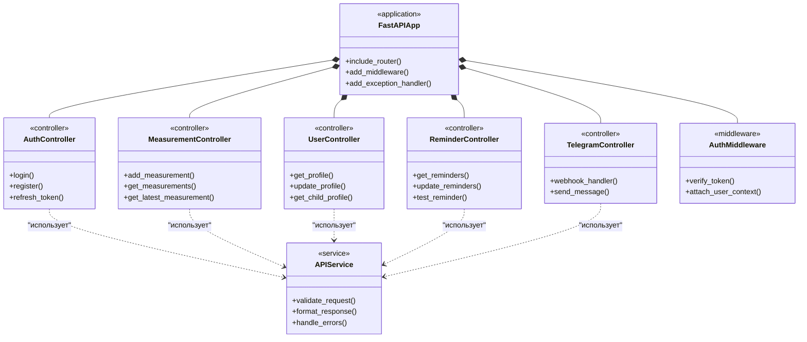

# Диаграммы классов для системы "Пикфлоуметр"

## 1. Диаграмма основных классов доменной области

```mermaid
classDiagram
    class User {
        <<entity>>
        -id: int
        -username: string
        -email: string
        -password_hash: string
        -role: string
        -is_active: boolean
        +authenticate()
        +update_profile()
    }

    class ChildProfile {
        <<entity>>
        -id: int
        -user_id: int
        -parent_id: int
        -first_name: string
        -last_name: string
        -birth_date: date
        -height: int
        -gender: string
        -best_result: int
        +calculate_zones()
        +get_age()
    }

    class Measurement {
        <<entity>>
        -id: int
        -child_id: int
        -value: int
        -timestamp: datetime
        -zone: string
        -notes: string
        +validate_value()
        +determine_zone()
    }

    class Reminder {
        <<entity>>
        -id: int
        -child_id: int
        -time_of_day: time
        -days_of_week: int[]
        -is_active: boolean
        -notification_type: string
        +is_due()
        +schedule_next()
    }

    class Notification {
        <<entity>>
        -id: int
        -user_id: int
        -reminder_id: int
        -message_text: string
        -sent_at: datetime
        -status: string
        -notification_channel: string
        +send()
        +update_status()
    }

    class ZoneCalculator {
        <<service>>
        +calculate_zones(child_profile: ChildProfile)
        +determine_zone(measurement_value: int, zones: Zones)
        +get_medical_formulas()
    }

    class AuthenticationService {
        <<service>>
        +login(credentials)
        +register(user_data)
        +verify_token(token)
        +hash_password(password)
    }

    class MeasurementService {
        <<service>>
        +add_measurement(data)
        +get_measurements(child_id, filters)
        +calculate_statistics(child_id)
    }

    class ReminderService {
        <<service>>
        +create_reminder(reminder_data)
        +update_reminder(reminder_id, data)
        +get_due_reminders()
        +process_reminders()
    }

    User ||--o{ ChildProfile : "родительские права"
    ChildProfile ||--o{ Measurement : "создает"
    ChildProfile ||--o{ Reminder : "имеет"
    Reminder ||--o{ Notification : "генерирует"
    ZoneCalculator ..> ChildProfile : "использует для расчета"
    ZoneCalculator ..> Measurement : "анализирует"
    AuthenticationService ..> User : "аутентифицирует"
    MeasurementService ..> Measurement : "управляет"
    ReminderService ..> Reminder : "управляет"
    ReminderService ..> Notification : "создает"
```

## 2. Диаграмма веб-слоя (API и контроллеры)



## 3. Диаграмма слоя доступа к данным

```mermaid
classDiagram
    class DatabaseManager {
        <<repository>>
        +get_session()
        +execute_query()
        +transaction()
    }

    class UserRepository {
        <<repository>>
        +create_user()
        +get_user_by_email()
        +update_user()
        +get_parent_children()
    }

    class ChildProfileRepository {
        <<repository>>
        +create_profile()
        +get_profile()
        +update_profile()
        +get_child_by_parent()
    }

    class MeasurementRepository {
        <<repository>>
        +create_measurement()
        +get_measurements()
        +get_latest_measurement()
        +get_measurements_by_date_range()
    }

    class ReminderRepository {
        <<repository>>
        +create_reminder()
        +get_reminders()
        +update_reminder()
        +get_due_reminders()
    }

    class NotificationRepository {
        <<repository>>
        +create_notification()
        +update_notification_status()
        +get_notifications_by_user()
    }

    class SchemaValidator {
        <<utility>>
        +validate_user_schema()
        +validate_measurement_schema()
        +validate_reminder_schema()
    }

    DatabaseManager ||-- UserRepository
    DatabaseManager ||-- ChildProfileRepository
    DatabaseManager ||-- MeasurementRepository
    DatabaseManager ||-- ReminderRepository
    DatabaseManager ||-- NotificationRepository
    UserRepository ..> SchemaValidator : "использует"
    ChildProfileRepository ..> SchemaValidator : "использует"
    MeasurementRepository ..> SchemaValidator : "использует"
    ReminderRepository ..> SchemaValidator : "использует"
    NotificationRepository ..> SchemaValidator : "использует"