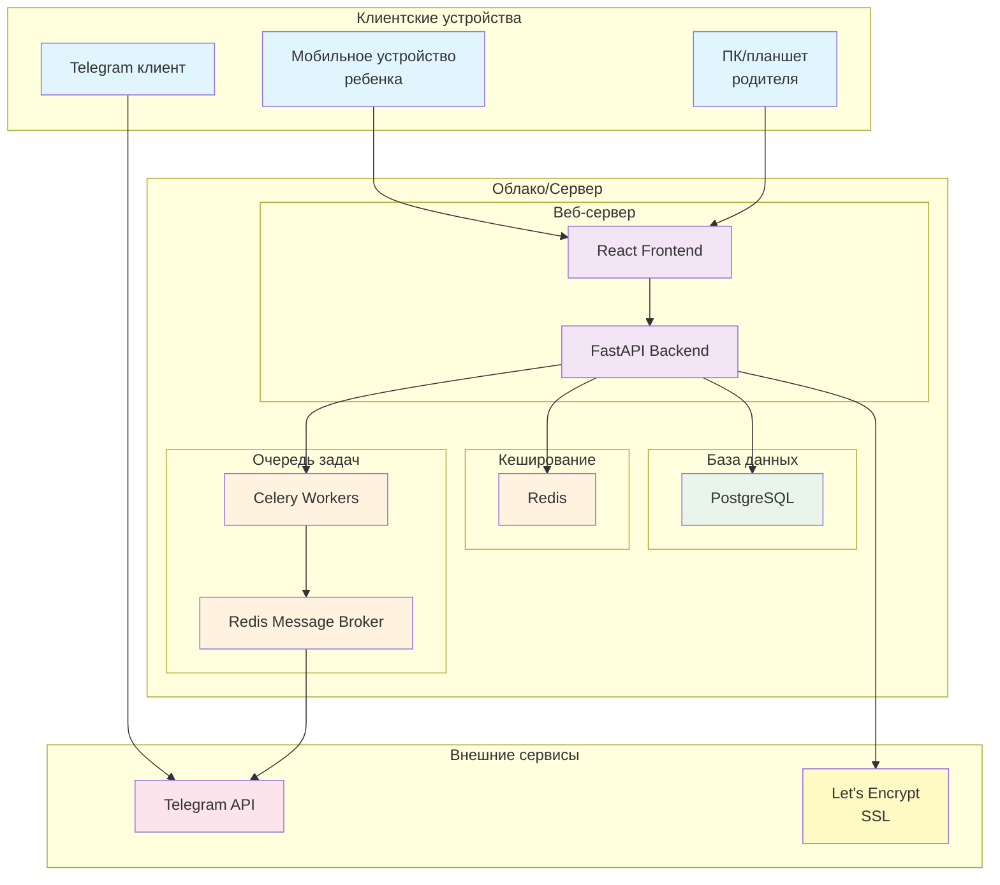

# Диаграмма развертывания системы "Пикфлоуметр"

## Описание компонентов

### Клиентские устройства
- **Мобильное устройство ребенка**: Основное устройство для ежедневного ввода замеров, поддерживает PWA или мобильный браузер
- **ПК/планшет родителя**: Для просмотра статистики, настройки профиля и управления системой
- **Telegram клиент**: Для получения уведомлений и быстрого ввода данных через бота

### Веб-сервер
- **FastAPI Backend**: Основной сервер приложения, обрабатывающий бизнес-логику, API запросы и аутентификацию
- **React Frontend**: Веб-интерфейс с адаптивным дизайном для различных устройств

### База данных
- **PostgreSQL**: Основная реляционная база данных для хранения всех данных приложения

### Кеширование
- **Redis**: Для кеширования часто запрашиваемых данных и сессий пользователей

### Очередь задач
- **Celery Workers**: Обработка фоновых задач, таких как отправка уведомлений и напоминаний
- **Redis Message Broker**: Очередь для асинхронной обработки задач

### Внешние сервисы
- **Telegram API**: Для интеграции с Telegram-ботом
- **Let's Encrypt SSL**: Для обеспечения безопасного соединения