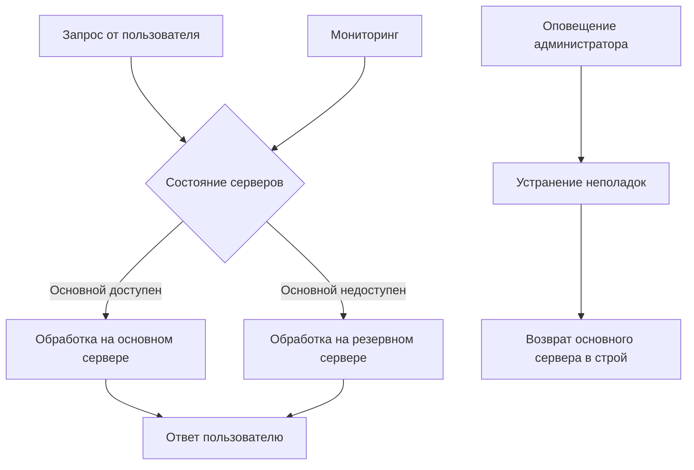

# Сценарии отказоустойчивости и восстановления системы "Пикфлоуметр"

## 1. Общие принципы отказоустойчивости

Система "Пикфлоуметр" спроектирована с учетом принципов отказоустойчивости, чтобы обеспечить непрерывную работу и доступность данных даже при возникновении различных видов отказов. Ниже приведены сценарии возможных отказов и меры по их предотвращению и восстановлению.

## 2. Классификация отказов

### 2.1. Аппаратные отказы
- Отказ сервера
- Отказ дискового хранилища
- Отказ сетевого оборудования
- Отказ оперативной памяти

### 2.2. Программные отказы
- Падение приложения
- Утечка памяти
- Ошибки в логике приложения
- Блокировка базы данных

### 2.3. Сетевые отказы
- Потеря сетевого соединения
- DDoS-атаки
- Отказ провайдера интернет-услуг

### 2.4. Отказы внешних сервисов
- Отказ Telegram API
- Отказ почтового сервиса
- Отказ CDN-провайдера

## 3. Стратегии предотвращения отказов

### 3.1. Резервирование компонентов
- Использование облачных сервисов с SLA не менее 99.9%
- Горячее резервирование базы данных (master-slave репликация)
- Использование балансировщиков нагрузки
- Дублирование критических компонентов

### 3.2. Мониторинг и оповещение
- Непрерывный мониторинг состояния системы
- Автоматические оповещения о сбоях
- Мониторинг производительности и использования ресурсов
- Логирование всех событий системы

## 4. Сценарии отказоустойчивости

### 4.1. Отказ основного сервера

**Сценарий**: Основной сервер перестает отвечать на запросы

**Меры предотвращения**:
- Использование кластера из минимум 2 серверов
- Настройка автоматического перенаправления трафика на резервный сервер

**Алгоритм восстановления**:
1. Балансировщик нагрузки обнаруживает недоступность основного сервера
2. Трафик автоматически перенаправляется на резервный сервер
3. Система оповещает администратора об отказе
4. После устранения неполадок основной сервер возвращается в строй

### 4.2. Отказ базы данных

**Сценарий**: Основная база данных становится недоступной

**Меры предотвращения**:
- Настройка master-slave репликации PostgreSQL
- Регулярное резервное копирование
- Использование подключений с механизмом повтора

**Алгоритм восстановления**:
1. Приложение обнаруживает недоступность основной БД
2. Автоматическое переключение на резервную БД
3. Система оповещает администратора
4. После восстановления основной БД происходит синхронизация и переключение обратно

### 4.3. Переполнение памяти

**Сценарий**: Приложение использует больше памяти, чем доступно

**Меры предотвращения**:
- Настройка лимитов памяти для контейнеров
- Использование сборщика мусора
- Мониторинг использования памяти

**Алгоритм восстановления**:
1. Система мониторинга обнаруживает превышение лимита памяти
2. Приложение автоматически перезапускается
3. Выполняется очистка кэша
4. Система оповещает администратора для анализа причины

### 4.4. Отказ внешнего сервиса (Telegram API)

**Сценарий**: Telegram API недоступен, невозможно отправить уведомления

**Меры предотвращения**:
- Использование очереди задач (Celery) для асинхронной отправки
- Механизм повторных попыток с экспоненциальной задержкой
- Альтернативные каналы уведомлений

**Алгоритм восстановления**:
1. При невозможности отправки сообщения в Telegram, задача возвращается в очередь
2. Система повторяет попытку с экспоненциальной задержкой
3. После нескольких неудачных попыток уведомление сохраняется в лог
4. При восстановлении Telegram API отправка возобновляется

## 5. Резервное копирование и восстановление

### 5.1. Регулярное резервное копирование

**Частота резервного копирования**:
- Полное резервное копирование базы данных: ежедневно в 02:00 по МСК
- Инкрементальное резервное копирование: каждые 4 часа
- Резервное копирование конфигурационных файлов: при каждом изменении

**Хранение резервных копий**:
- На отдельных серверах в разных географических зонах
- Шифрование резервных копий AES-256
- Хранение копий за последние 30 дней (ежедневные) и 12 месяцев (ежемесячные)

### 5.2. План восстановления после аварии

**RTO (Recovery Time Objective)**: 2 часа
**RPO (Recovery Point Objective)**: 4 часа (максимальная потеря данных)

**Этапы восстановления**:
1. Оценка масштаба аварии
2. Активация резервной инфраструктуры
3. Восстановление базы данных из последней резервной копии
4. Восстановление конфигурационных файлов
5. Запуск приложения
6. Проверка работоспособности
7. Перенаправление трафика на восстановленную систему

## 6. Тестирование отказоустойчивости

### 6.1. Регулярные тесты
- Ежеквартальное тестирование восстановления из резервной копии
- Тестирование сценариев отказа компонентов (chaos engineering)
- Проверка времени восстановления (RTO) и объема потерь данных (RPO)

### 6.2. Документирование
- Ведение журнала инцидентов
- Анализ причин отказов
- Обновление процедур восстановления на основе полученного опыта

## 7. Мониторинг и оповещения

### 7.1. Метрики для мониторинга
- Доступность сервисов (uptime)
- Время отклика API
- Загрузка CPU, памяти, дисков
- Количество ошибок в приложении
- Состояние базы данных
- Состояние очередей задач

### 7.2. Системы оповещения
- Интеграция с системами мониторинга (Prometheus, Grafana)
- Автоматические оповещения по email и SMS
- Интеграция с мессенджерами для срочных уведомлений
- Система тикетов для отслеживания инцидентов

## 8. Дополнительные меры

### 8.1. Географическое распределение
- Размещение резервных копий в разных дата-центрах
- Использование CDN для статических ресурсов
- Возможность быстрого развертывания в альтернативном регионе

### 8.2. Планирование емкости
- Мониторинг использования ресурсов
- Прогнозирование роста нагрузки
- Планирование масштабирования инфраструктуры