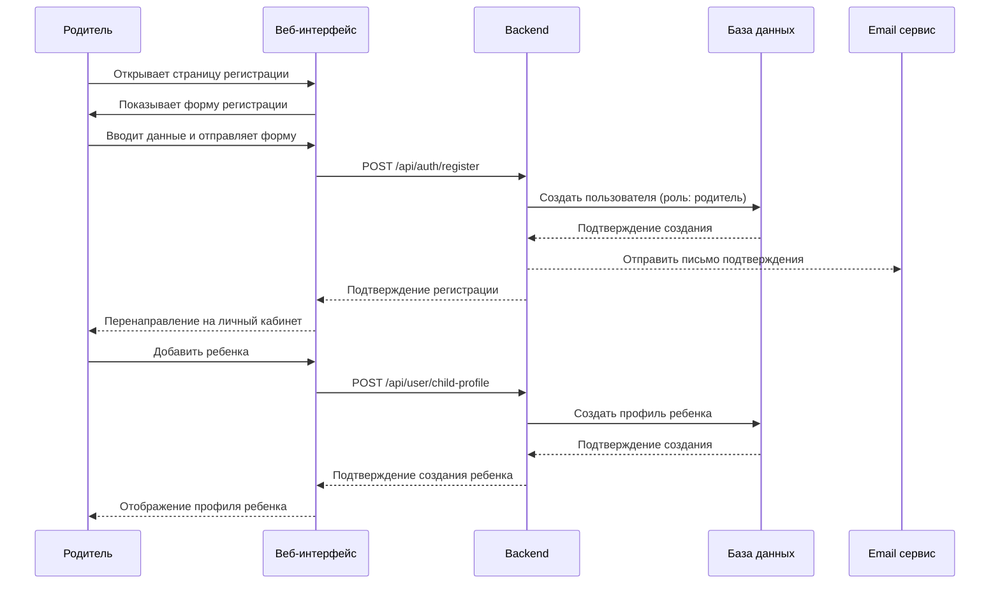
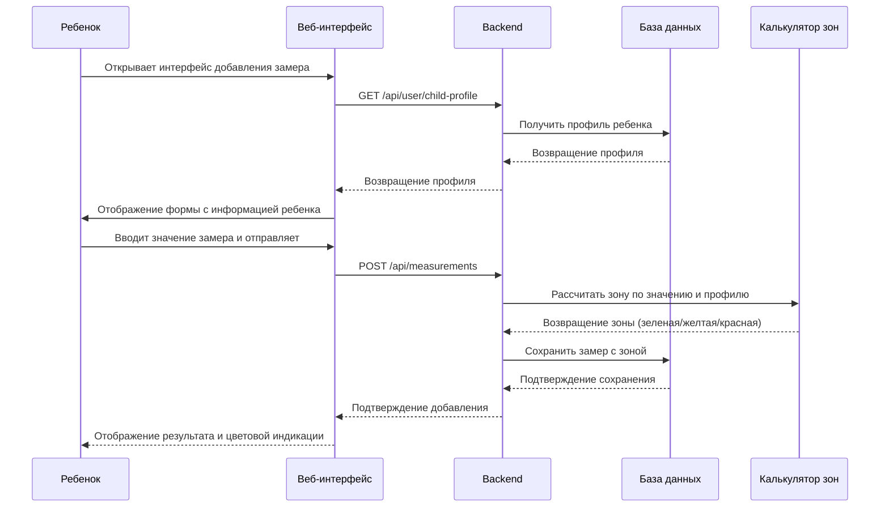
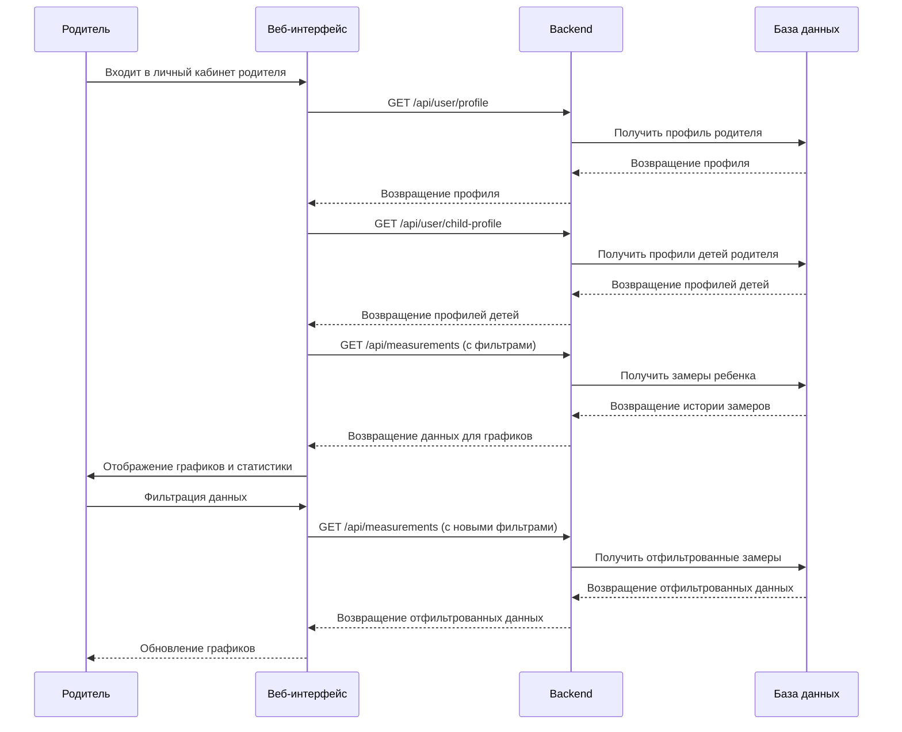
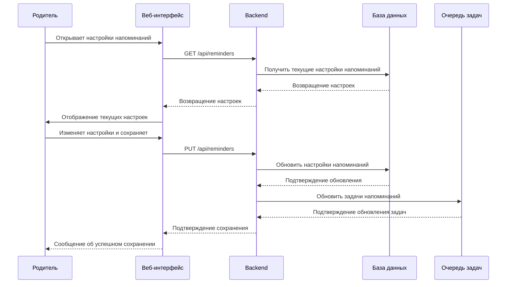

# Диаграммы последовательности для системы "Пикфлоуметр"

## 1. Сценарий: Регистрация родителя и добавление ребенка



## 2. Сценарий: Добавление замера ребенком



## 3. Сценарий: Просмотр статистики родителем



## 4. Сценарий: Настройка напоминаний



## 5. Сценарий: Получение уведомлений через Telegram-бота

```mermaid
sequenceDiagram
    participant Telegram as Telegram
    participant Bot as Telegram-бот
    participant BE as Backend
    participant DB as База данных
    participant TaskQueue as Очередь задач

    Note over Telegram,TaskQueue: Периодическая задача (Celery)
    TaskQueue->>BE: Запуск задачи отправки напоминаний
    BE->>DB: Получить активные напоминания
    DB-->>BE: Возвращение списка напоминаний
    loop Для каждого напоминания
        BE->>DB: Получить информацию о ребенке и родителе
        DB-->>BE: Возвращение информации
        BE->>Bot: Отправить сообщение через Telegram API
        Bot->>Telegram: Отправить сообщение пользователю
    end
    Telegram->>Bot: Пользователь отвечает боту
    Bot->>BE: POST /api/telegram/webhook
    BE->>DB: Обработать команду пользователя
    DB-->>BE: Подтверждение обработки
    BE-->>Bot: Ответ на команду
    Bot-->>Telegram: Отправить ответ пользователю